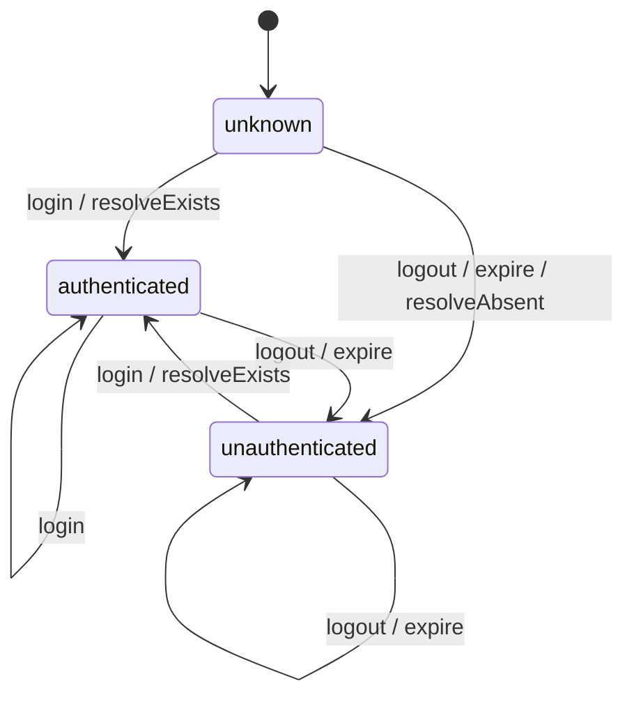

# U0 Foundation — Business Logic Model

> CONSTRUCTION / Functional Design 산출물 (단위: U0). 로직 흐름/상태 모델 + PBT property 후보 + 셸 수준 컴포넌트.
> 기술 비종속. 순수 함수 4종이 핵심 (PBT-01 대상).

---

## 1. 순수 함수 시그니처 (`domain/logic/`)

```ts
// profileValidation
function isValidHeight(raw: string): boolean;          // 하드: 정수 & 2~3자리
function isValidWeight(raw: string): boolean;          // 하드: 정수 & 2~3자리
function isHeightInRange(cm: number): boolean;         // 소프트: 50~250
function isWeightInRange(kg: number): boolean;         // 소프트: 20~300
function isProfileComplete(p: OnboardingProfile): boolean; // 하드 통과 + gender 존재

// sessionLogic
type AuthEvent = 'login' | 'logout' | 'expire' | 'resolveExists' | 'resolveAbsent';
function nextAuthStatus(current: AuthStatus, event: AuthEvent): AuthStatus;

// gateRules
function isAllowed(status: AuthStatus, action: GateAction): boolean;

// regionLogic
function resolveDefaultRegion(regions: Region[]): Region;
```

---

## 2. 세션 상태 모델 (Mermaid)



### Text Alternative
```
초기: unknown
unknown        -> authenticated   : login | resolveExists
unknown        -> unauthenticated : logout | expire | resolveAbsent
authenticated  -> unauthenticated : logout | expire
unauthenticated-> authenticated   : login | resolveExists
(동일 상태로의 이벤트는 멱등: 상태 불변)
```

---

## 3. 데이터/로직 흐름 (U0가 제공하는 토대)

```
[입력 검증]  raw 문자열 -> isValidHeight/Weight (하드) -> isProfileComplete -> canSubmit(boolean)
                                         \-> isHeight/WeightInRange (소프트) -> 경고 표시 여부

[세션]  AuthEvent -> nextAuthStatus -> AuthStatus (application의 sessionStore가 보관)

[게이트]  (AuthStatus, GateAction) -> isAllowed -> boolean (application이 시트 오픈 결정)

[지역]  Region[] -> resolveDefaultRegion -> Region (기본 선택)
```

---

## 4. PBT Property 후보 (PBT-01 / PBT-10)

| 함수 | Property | 종류 |
|---|---|---|
| isValidHeight | 길이 2~3 정수 문자열 ⇔ true; 그 외 false | 불변/동치 |
| isValidWeight | 길이 2~3 정수 문자열 ⇔ true; 그 외 false | 불변/동치 |
| isProfileComplete | (키 하드 통과 ∧ 체중 하드 통과 ∧ gender≠undefined) ⇔ true | 동치 |
| isProfileComplete | 소프트 범위 경고 유무는 결과에 영향 없음 | 독립성 |
| nextAuthStatus | 임의 상태에서 logout/expire → 항상 unauthenticated | 흡수성 |
| nextAuthStatus | login → 항상 authenticated | 흡수성 |
| nextAuthStatus | 같은 결과 이벤트 반복 = 멱등(상태 불변) | 멱등성 |
| isAllowed | myPageTab은 모든 status에서 true | 불변 |
| isAllowed | 비-myPageTab 액션은 status≠authenticated에서 false | 결정표 전수 |
| resolveDefaultRegion | 군산 포함 목록 → 항상 군산 반환 | 불변 |
| resolveDefaultRegion | 임의 목록(빈 목록 포함) → 항상 유효 Region 반환(non-null) | 전역 불변 |

> example-based 테스트(경계값: 1/2/3/4자리, 빈 문자열, 음수, 선행 0)와 병행 (PBT-10).

---

## 5. 셸 수준 컴포넌트 (U0, UI 스토리 없음 — 골격만)

| 컴포넌트 | 책임 | 상태/props |
|---|---|---|
| `AppRoot` | Provider 조립(추후 QueryClient/Router 도입 자리) + 부트스트랩 훅 | — |
| `AppRouter` | 라우트 골격(`/onboarding`, `/main`, `/records`, `/mypage`), 시트=history 엔트리 정책 | route config |
| `BottomTabBar` | 메인/기록/마이페이지 탭 표시(껍데기). 실제 게이트 동작은 U1 useGate 도입 후 연결 | `activeTab` |
| `SafeAreaLayout` | 100dvh + safe-area-inset + overscroll/long-press/tap-highlight 비활성 | children |
| 디자인 토큰 | 색/타이포/간격/반경 CSS 변수 + Tailwind theme(Lo-Fi 기본값) | — |

> U0 단계에서 BottomTabBar는 시각적 골격 + 라우팅만. 게이트 연동/세션 의존은 U1에서 점진 도입(Q3=B).

---

## 6. 본 단계 비대상 (다음 단계로)
- apiClient/MSW, bridge/mockBridge/BridgeService, sessionStore/SessionService, AsyncBoundary 구현 → NFR Design/Code Generation 및 후속 단위(주로 U1).
- 실제 React 컴포넌트 코드 → Code Generation.
