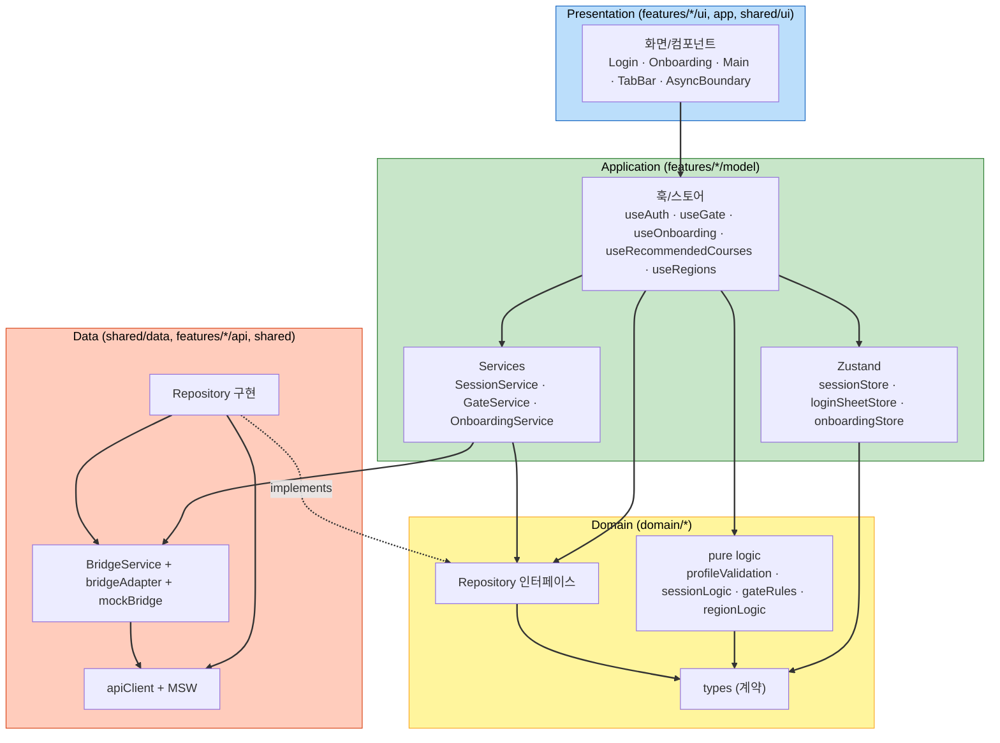

# Component Dependency — Login · V01 · V02

> Application Design 산출물. 의존 관계 + 통신 패턴 + 데이터 흐름.
> 의존 방향 원칙: **presentation → application(hooks) → domain ← data**. domain은 무엇에도 의존하지 않음.

---

## 1. 레이어 의존 다이어그램 (Mermaid)



### Text Alternative (always included)
```
Presentation (UI)
   depends on -> Application (hooks/stores/services)

Application
   hooks   -> stores, services, domain.logic, domain.repositoryInterfaces
   services-> domain.repositoryInterfaces, BridgeService
   stores  -> domain.types

Domain (types, pure logic, repository INTERFACES)
   depends on -> nothing (의존 없음)

Data
   repositoryImpl  implements domain.repositoryInterfaces
   repositoryImpl  -> apiClient(+MSW), BridgeService
   BridgeService   -> bridgeAdapter / mockBridge

핵심: domain은 어떤 레이어에도 의존하지 않음. data는 domain의 인터페이스를 구현(역의존).
```

---

## 2. 의존 매트릭스

| ↓이것이 →이것에 의존 | domain.types | domain.logic | RepoIF | RepoImpl | apiClient | BridgeService | sessionStore |
|---|:--:|:--:|:--:|:--:|:--:|:--:|:--:|
| UI (presentation) |  |  |  |  |  |  |  |
| hooks (application) | ● | ● | ● |  |  | ●(간접) | ● |
| services | ● | ● | ● |  |  | ● | ● |
| RepoImpl (data) | ● |  | ●(impl) |  | ● | ● |  |
| BridgeService | ● |  |  |  | ●(401연계) |  |  |

(● = 의존. UI는 오직 hooks/stores를 통해서만 하위 접근 — 직접 data/domain 접근 없음)

---

## 3. 통신 패턴

| 경로 | 패턴 |
|---|---|
| UI → hooks | React 훅 호출 / 구독 (리렌더) |
| hooks → 서버 데이터 | TanStack Query(queryFn = Repository 메서드), 캐시·로딩·에러·재시도 |
| hooks/services → 네이티브(async) | BridgeService → bridgeAdapter (request-id + promise registry) |
| hooks/services → 네이티브(one-way) | BridgeService.post (화면 전환) |
| 네이티브 → 웹 | BridgeService.on(event) → SessionService 등 단일 구독자 |
| 401 발생 | apiClient.onUnauthorized → SessionService → sessionStore 무효화 |
| 전역 상태 전파 | Zustand store 구독 (sessionStore가 인증 단일 출처) |

---

## 4. 대표 데이터 흐름

### 4.1 소셜 로그인 (LOGIN-S2)
```
LoginBottomSheet(버튼) -> useAuth.login('kakao')
  -> AuthRepository.login -> BridgeService(bridge.login) -> 네이티브 OAuth -> AppSession
  -> apiClient.setToken(메모리) -> sessionStore=authenticated -> 시트 close
```

### 4.2 추천 코스 로딩 (V02-S1)
```
MainView -> useRecommendedCourses(regionCode)
  -> TanStack Query -> CourseRepository.listRecommended -> apiClient(GET) or MSW
  -> AsyncBoundary가 로딩/에러/빈 상태 렌더(SECURITY-15)
```

### 4.3 게이트 → 로그인 (LOGIN-S1 / V02-S2)
```
기록 탭 클릭 -> useGate.guard('recordsTab')
  -> gateRules.isAllowed(status,'recordsTab')
     false -> loginSheetStore.open (중복 방지) -> LoginBottomSheet 노출
     true  -> V11 라우팅
```

### 4.4 세션 만료 (LOGIN-S4 / FR-LOGIN-06)
```
API 401  --\
            >-- SessionService(중복가드 1회) -> sessionStore=unauthenticated
sessionChanged(logout) --/         -> apiClient.setToken(null)
                                   -> navigate(V02) + Toast("로그아웃되었습니다")
```

---

## 5. 설계 일관성 점검
- [x] 의존 방향 단방향 유지 (presentation→application→domain←data), 순환 없음
- [x] domain 무의존 (types/logic/RepoIF는 외부 import 없음)
- [x] UI는 data/브릿지 직접 접근 없음 (hooks/services 경유)
- [x] 인증 단일 출처(sessionStore) — 모든 인증 분기 파생
- [x] 브릿지 단일 추상화(BridgeService) — window.DallYeoBridge 직접 참조 없음
- [x] Q1~Q6 결정 사항 반영(TanStack Query·Zustand·React Router·도메인별 Repo·혼합 브릿지·AsyncBoundary)
