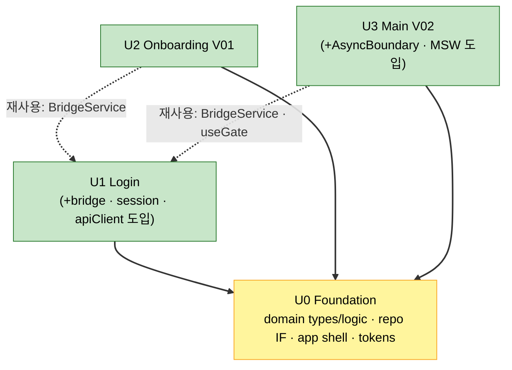

# Unit of Work Dependency — Login · V01 · V02

> Units Generation 산출물. 단위 간 의존 매트릭스 + 점진 인프라 도입 지점.
> 원칙(Q4=A): 단위 간 **직접 의존 없음**. 모든 공유는 U0(shared/domain) 네임스페이스를 경유.

---

## 1. 의존 다이어그램 (Mermaid)



### Text Alternative (always included)
```
U0 Foundation  : 의존 없음 (토대)
U1 Login       -> U0
U2 Onboarding  -> U0 ; (재사용) U1.BridgeService(requestPermission)
U3 Main        -> U0 ; (재사용) U1.BridgeService(openCourseSearch/Confirm), U1.useGate(탭바)

실선(-->) = 빌드 의존(U0 shared/domain import)
점선(-.->) = 기능 재사용(U1이 도입한 공통 인프라를 후속 단위가 사용; 단위 간 직접 결합이 아니라 shared/ 경유)
순환 의존 없음.
```

---

## 2. 의존 매트릭스

| 단위 ↓ depends on → | U0 | U1 | U2 | U3 |
|---|:--:|:--:|:--:|:--:|
| U0 Foundation |  |  |  |  |
| U1 Login | ● |  |  |  |
| U2 Onboarding | ● | ◐(BridgeService) |  |  |
| U3 Main | ● | ◐(BridgeService, useGate) |  |  |

(● 빌드 의존 / ◐ shared 경유 기능 재사용 / 공란 무의존)

---

## 3. 점진 인프라 도입 지점 (Q3=B)

Foundation을 골격만으로 한정했으므로, 공통 인프라는 아래 단위에서 **최초 생성**되어 이후 단위가 재사용:

| 공통 인프라 (shared/) | 최초 도입 단위 | 이후 재사용 |
|---|---|---|
| bridgeAdapter + mockBridge + BridgeService | U1 | U2(권한), U3(코스 전환) |
| sessionStore + SessionService | U1 | U3(탭바 게이트 인증상태) |
| apiClient + queryClient | U1 (Bearer/401) | U3(코스/지역 쿼리) |
| AsyncBoundary | U3 | 이후 라운드 데이터 화면 |
| MSW 핸들러 | U1(인증 일부) · U3(코스/지역) | 단위별 추가 |

> 도입 단위가 달라도 산출물은 `shared/`에 위치 → 단위 간 직접 의존이 아니라 공유 네임스페이스 의존(Q4=A 일관).

---

## 4. 구축 순서 정당성 (Q2=A)
```
U0 (토대: 타입/로직/셸/토큰)
  -> U1 (인증 + bridge/session/apiClient 인프라 최초 도입)
     -> U2 (U1의 BridgeService 권한 재사용)
     -> U3 (U1의 BridgeService/useGate + AsyncBoundary 도입)
```
- U1을 U2/U3보다 먼저: 공통 인프라(브릿지/세션/apiClient)를 U1이 도입하므로 후속 단위가 이를 전제로 진행 가능.
- 순환 없음, 각 단위 진입 시 선행 의존 충족됨.

---

## 5. 검증
- [x] 순환 의존 없음
- [x] 단위 간 직접 의존 0 (모두 U0/shared 경유) — Q4=A 충족
- [x] 구축 순서가 의존 방향과 일치 — Q2=A 충족
- [x] 점진 인프라 도입 지점 명시 — Q3=B 충족
- [x] Mermaid 검증 + 텍스트 대체 포함
