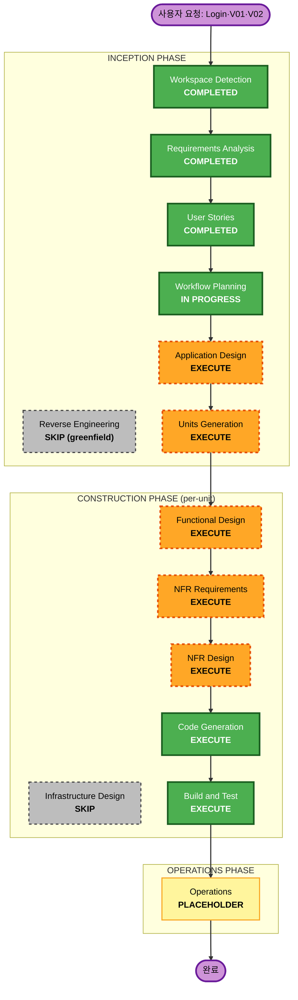

# Execution Plan — 달여(DallYeo) Frontend (Login · V01 · V02)

> Workflow Planning 단계 산출물. 어떤 단계를 실행/생략할지와 그 근거를 정의합니다.
> 입력: `requirements.md`, `stories.md`, `personas.md`.

---

## Detailed Analysis Summary

### Transformation Scope
- **프로젝트 유형**: Greenfield (브라운필드 변환 분석 N/A — 기존 코드/인프라 없음)
- **주요 변경**: 신규 WebView SPA 첫 단위 구축 — 3개 화면(Login·V01·V02) + 공통 셸/브릿지/API 인프라

### Change Impact Assessment
- **User-facing changes**: Yes — 3개 신규 화면 + 하단 탭바 + 로그인 바텀시트 (직접 사용자 노출)
- **Structural changes**: Yes — 전체 아키텍처 신규 수립 (FSD-lite, Repository 패턴, 브릿지 추상화)
- **Data model changes**: Yes — 도메인 타입 신규 정의 (AppSession, Course, Region, OnboardingProfile, PermissionStatus, RunResult 등 — 백엔드·네이티브와의 계약)
- **API changes**: Yes — typed API 클라이언트 + MSW mock 신규 (엔드포인트 스펙은 Application Design에서 백엔드 협의 후 확정)
- **NFR impact**: Yes — Security Baseline + PBT 전체 강제, WebView 호환성, 브릿지 async, Lo-Fi 토큰

### Risk Assessment
- **Risk Level**: **Medium** — 다수 컴포넌트 + 네이티브 브릿지 async + mock/실 백엔드 혼용. 단, 그린필드라 롤백 부담은 낮음.
- **Rollback Complexity**: Easy (신규 코드, 운영 의존성 없음)
- **Testing Complexity**: Moderate — example-based + PBT 병행 의무 (PBT-10), 브릿지/백엔드 mock 필요

---

## Workflow Visualization

### Mermaid Diagram



### Text Alternative (always included)

```
INCEPTION PHASE
- Workspace Detection ....... COMPLETED
- Reverse Engineering ....... SKIP (greenfield)
- Requirements Analysis .... COMPLETED
- User Stories ............. COMPLETED
- Workflow Planning ........ IN PROGRESS
- Application Design ....... EXECUTE
- Units Generation ........ EXECUTE

CONSTRUCTION PHASE (per-unit loop)
- Functional Design ....... EXECUTE
- NFR Requirements ........ EXECUTE
- NFR Design .............. EXECUTE
- Infrastructure Design ... SKIP
- Code Generation ......... EXECUTE (always)
- Build and Test .......... EXECUTE (always)

OPERATIONS PHASE
- Operations .............. PLACEHOLDER
```

---

## Phases to Execute

### 🔵 INCEPTION PHASE
- [x] Workspace Detection (COMPLETED)
- [x] Reverse Engineering (SKIPPED — greenfield, 기존 코드 없음)
- [x] Requirements Analysis (COMPLETED)
- [x] User Stories (COMPLETED)
- [x] Workflow Planning (IN PROGRESS)
- [ ] **Application Design — EXECUTE**
  - **Rationale**: 신규 컴포넌트/서비스 전면 정의 필요 — 도메인 타입(계약), Repository 인터페이스, 브릿지 인터페이스, API 클라이언트 경계, 앱 셸/라우팅/탭바 구조. 백엔드·네이티브 팀과의 계약 확정 지점.
- [ ] **Units Generation — EXECUTE**
  - **Rationale**: 작업을 단위로 분해할 가치 있음. 권고 단위: ① **Foundation**(공통: 도메인 타입·API 클라이언트·MSW·브릿지 추상화·mock 브릿지·앱 셸/탭바·디자인 토큰) → ② **Login** → ③ **V01 온보딩** → ④ **V02 메인뷰**. CLAUDE.md Construction 순서(types → API+MSW → bridge → shell → views)와 일치.

### 🟢 CONSTRUCTION PHASE (단위별 반복)
- [ ] **Functional Design — EXECUTE**
  - **Rationale**: 신규 도메인 모델 + 복잡 비즈니스 로직(입력 검증, 세션 상태머신, 게이트 규칙). PBT-01(testable property 식별) 의무 단계.
- [ ] **NFR Requirements — EXECUTE**
  - **Rationale**: Security Baseline + PBT 강제, PBT 프레임워크 선정(PBT-09, 후보 fast-check), WebView 호환·성능 요건 정리.
- [ ] **NFR Design — EXECUTE**
  - **Rationale**: NFR Requirements 실행에 따라 보안/PBT/WebView 패턴 설계 반영.
- [ ] **Infrastructure Design — SKIP**
  - **Rationale**: 본 레이어는 앱 내부에 동봉되는 LOCAL 번들 SPA. 클라우드/서버 인프라는 백엔드·네이티브 소유. 클라이언트 측 배포 인프라 신규 정의 없음. (필요 시 추후 OTA/remote-URL 검토 시 재평가)
- [ ] **Code Generation — EXECUTE (ALWAYS)**
  - **Rationale**: 구현 계획 + 코드/테스트 생성. PBT-10(example-based + PBT 병행) 의무.
- [ ] **Build and Test — EXECUTE (ALWAYS)**
  - **Rationale**: 빌드·단위/통합 테스트·검증 필요.

### 🟡 OPERATIONS PHASE
- [ ] Operations — PLACEHOLDER
  - **Rationale**: 향후 배포/모니터링 확장 영역.

---

## Estimated Timeline
- **실행 단계 수**: INCEPTION 2개(AD, UG) + CONSTRUCTION 단위 4개 × (FD·NFRA·NFRD·CG) + Build and Test
- **추정 규모**: Medium. 각 단계는 휴먼 승인 게이트로 분절 진행 (정확한 시간 산정은 본 워크플로 범위 밖).

## Success Criteria
- **Primary Goal**: Login·V01·V02를 디바이스/백엔드 없이도 브라우저에서 풀-미리보기 가능한 Lo-Fi WebView SPA로 구축.
- **Key Deliverables**: 도메인 타입 · typed API 클라이언트 + MSW · 브릿지 추상화 + mock 브릿지 · 앱 셸/탭바 · Login·V01·V02 Lo-Fi 화면 + 테스트(example + PBT).
- **Quality Gates**: 23개 FR 충족 · 13개 스토리 AC 통과 · Security Baseline 전 규칙 compliance · PBT-01~10 적용 · WebView 호환(100dvh·safe-area·뒤로가기 제스처).
